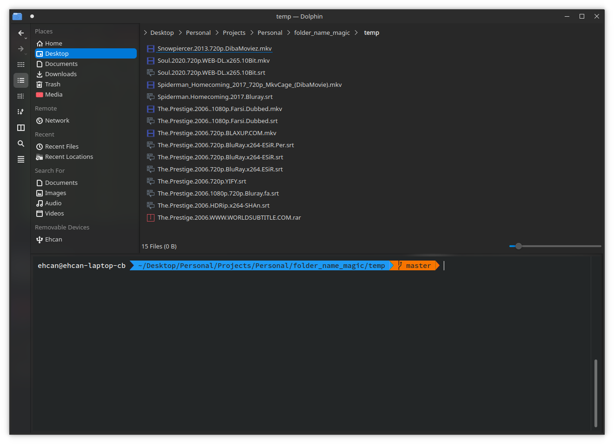
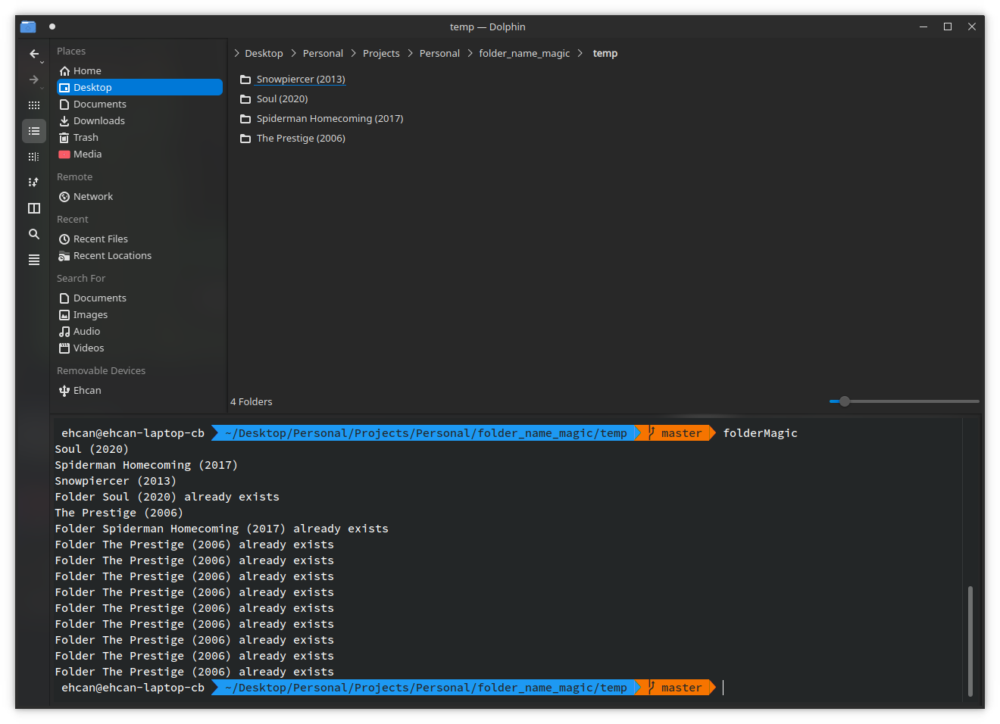

# Magical folder creator for movies


If you are as lazy as I am, you may need this tool :)

This tool creates a folder for each movie in current directory and move movie and subtitle and etc to created folder. Example:

### Before:


### After:


## Usage:

Just clone this repo somewhere like this:

```bash
$ cd ~/tools
$ git clone git@github.com:Ehcaning/magical_folder_creator_for_movies.git
```
Or if you prefer clone using HTTPS:
```bash
$ git clone https://github.com/Ehcaning/magical_folder_creator_for_movies.git
```

Then cd to directories with your movies in it:
```bash
$ cd /somewhere_with_movies_in_it
```
Then run the script like this:
```bash
$ python3 ~/tools/magical_folder_creator_for_movies/magic.py
```
And it's done :D

For easier access to script, you can make an alias for it with this simple command:
```bash
$ echo "alias folderMagic=\"python3 ~/tools/magical_folder_creator_for_movies/magic.py\"" >> ~/.bashrc
```
Or add it manually to `~/.bashrc`
```bash
alias folderMagic="python3 ~/tools/magical_folder_creator_for_movies/magic.py"
```

## Tests:
```bash
$ python3 tests.py
```
